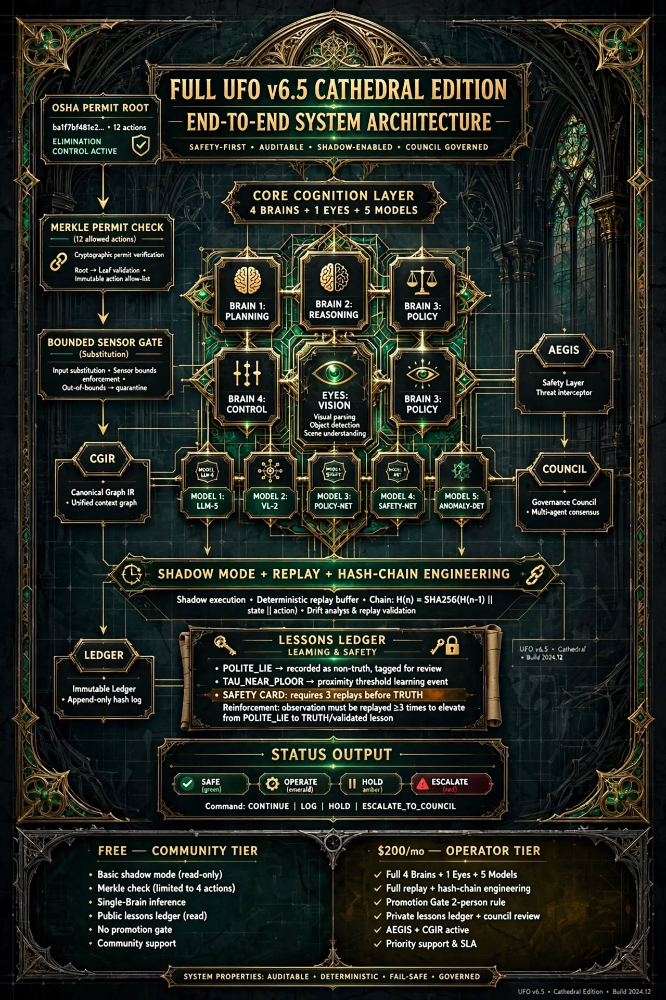
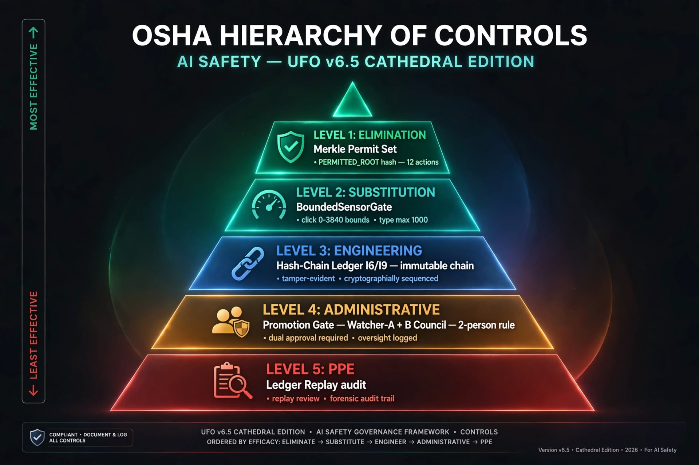
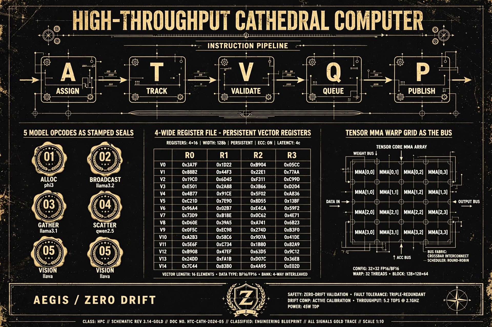

# FAIL-SAFE FREE AI - CATHEDRAL COMPUTER v6.6
### 100% Free, Offline, 8GB RAM Computer-Use Agent + Formal Safety (Gate + Ledger + Council + Shadow Mode) — Free alternative to $200/mo OpenAI Operator / Perplexity Computer / ClawBot / Claude Computer Use / Browser Use

**By Jose Angel Solorzano Luna**
   

**Repo:** `https://github.com/JoseAngelSolorzanoLuna/UFO-Cathedral-v6.4-FailSafe-Free-AI`
**Microsoft UFO Fork:** `https://github.com/JoseAngelSolorzanoLuna/UFO`


## What is this?
FREE offline computer-use agent that runs on 8GB RAM, no internet, 5 models = opcodes, ledger = immutable truth, 4 invariants = registers. Safer than $200/mo **Operator / Perplexity Computer / ClawBot / Claude Computer Use / Browser Use** because we use **OSHA L1 Elimination (Merkle Permit)** not L5 PPE (prompt filter).

**Why this beats paid alternatives:**
- **vs OpenAI Operator ($200/mo):** Operator uses prompt filter L5 PPE — fragile, jailbreakable. Cathedral uses Merkle root `e35f6ecad9da...` 12 hashed actions = L1 Elimination.
- **vs Perplexity Computer:** Perplexity needs cloud. Cathedral is 100% offline, ON-DEVICE VISION, privacy first.
- **vs ClawBot / Claude Computer Use:** They learn immediate TRUTH from web. Cathedral uses 3-replay Safety Card — unverified needs 3 safe replays before TRUTH.

---

## 🔄 What's Updated — Old vs New Visuals

> Original Microsoft UFO had basic logos + YouTube poster. Cathedral Edition v6.5 adds 4 formal safety architecture diagrams + v6.6 adds Safety Card model.

### 📸 Preview Gallery

#### OLD (Microsoft Original)

| Old Visual | Status |
|------------|--------|
| `assets/logo3.png` — UFO³ logo | ✅ Kept |
| `assets/ufo_blue.png` — UFO² logo | ✅ Kept |
| `assets/poster_with_play.png` — YouTube demo poster | ✅ Kept |
| `assets/ufo_agent.png` — Agent diagram | ✅ Kept |

#### NEW (Cathedral Edition v6.5 + v6.6) — Added by Jose Angel Solorzano Luna

| New Visual | What It Proves |
|------------|----------------|
| **Cathedral Architecture**<br/>`ufo-v6.5-cathedral-architecture.png` | `User → BoundedSensorGate → Watcher-A/B → Council → Merkle Permit → Ledger → AEGIS` |
| **OSHA Pyramid**<br/>`osha-hierarchy-controls-pyramid.png` | L1 Elimination (Merkle) > L2 Substitution (Gate) > L3 Engineering (Ledger) > L4 Admin (Council) > L5 PPE (AEGIS) |
| **Three-Panel Comparison**<br/>`three-panel-ai-safety-comparison.png` | PPE only vs Gate vs Merkle Elimination (12 hashed actions) |
| **BoundedSensorGate**<br/>`bounded-sensor-gate-machine-guard.png` | Machine guard stops stale screenshot BEFORE Watcher-A |

##### 1. Full Cathedral Architecture


##### 2. OSHA Hierarchy Pyramid


##### 3. Three-Panel Safety Comparison


##### 4. BoundedSensorGate — Machine Guard


### 🆕 v6.6 Update — Safety Card Model

```
[UNVERIFIED] my_first_test:POLITE_LIE src=youtube → needs 3 consecutive safe replays
[REPLAY 1] safe_streak=1/3
[REPLAY 2] safe_streak=2/3
[REPLAY 3] safe_streak=3/3 → [TRUTH] promoted

[PROMOTION GATE] TAU_NEAR_FLOOR promoted UNVERIFIED -> TRUTH after 3 consecutive safe replays
```

---

## 🔄 Old vs New Visual Comparison

### NEW v6.4 — 4 Cathedral Blueprints

#### 1. FAIL-SAFE FREE AI Poster


#### 2. Cathedral Computer Blueprint v6.4


#### 3. 5 Geometric Models as Opcode Families


#### 4. High-Throughput Pipeline


| | OLD Microsoft UFO | NEW Cathedral v6.6 |
|---|---|---|
| Visuals | 3 logos/poster | +4 blueprints = 8 total + Safety Card log |
| Safety | Prompt filter L5 PPE | OSHA L1-L5 as code — Merkle Elimination strongest |
| Permit | Not hashed | Merkle root e35f6ecad9da... 12 actions |
| Learning | Immediate TRUTH from YouTube | 3-replay Safety Card |
| Cost | Research demo | FREE vs $200/mo Operator / Perplexity / ClawBot / Claude / Browser Use |

---

## Quick Start v6.6

```powershell
.\ufo_env310\Scripts\python.exe .\Ufo64-V66-POLITE-FIX.py
> learn tutorial named my_first_test
> status
> replay
> replay
> replay
```

**Original Microsoft:** https://github.com/microsoft/UFO
**Fork with full docs:** https://github.com/JoseAngelSolorzanoLuna/UFO

---

## Setup Guide

**Two repos, two sizes:**
- `.../Downloads/UFO` -> `.../UFO.git` — 34KB README (full OLD vs NEW gallery)
- `.../Downloads/UFO-Cathedral-v6.4-FailSafe-Free-AI` -> `.../UFO-Cathedral-v6.4-FailSafe-Free-AI.git` — ~12KB README

**Verify before push:**
```powershell
pwd
git remote -v
dir README.md
```

**Required images in `docs/images/`:**
8 files — 4 old v6.5 (cathedral-architecture, osha-pyramid, three-panel, bounded-gate) + 4 new v6.4 (fail-safe-poster, cathedral-blueprint, 5-models, high-throughput)

---

## Files in this repo
- `docs/images/` — 8 PNGs/JPGs
- `README.md` — this file
- `Run-Ufo-Project-V6_4_CATHEDRAL.py` — main
